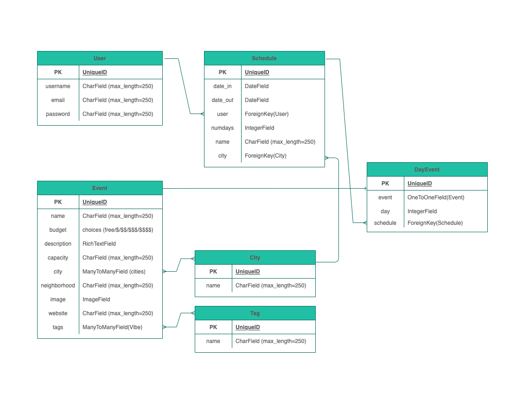
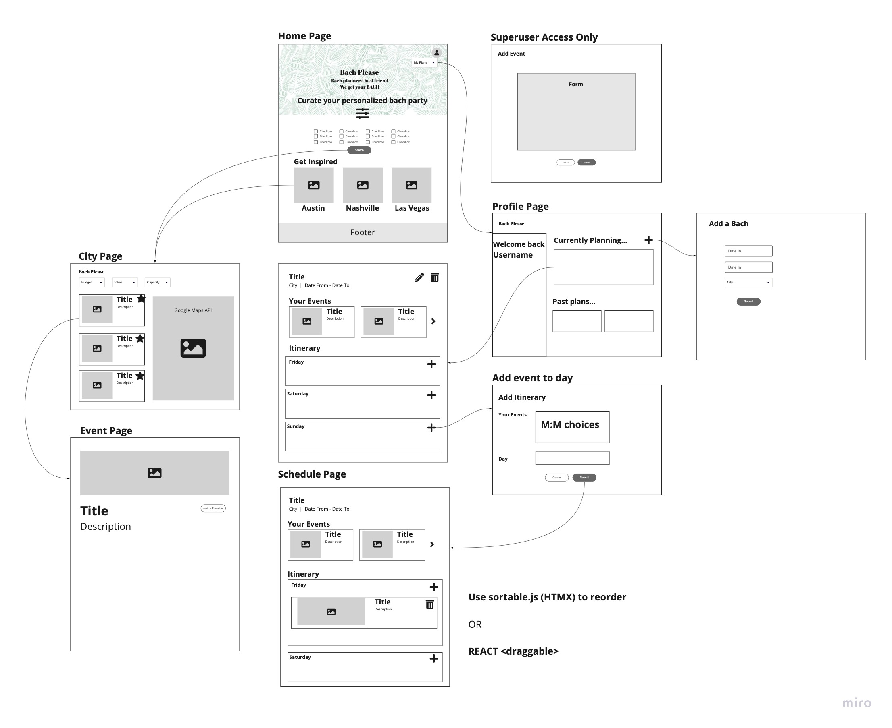

# Bach Please

Bachelor/Bachelorette party planner's best friend - curate the best weekend plan for the your soon-to-be bride and groom 

## Table of Contents
[Get Started](https://github.com/skim121/bachplease/#get-started) 
|
[Brainstorming](https://github.com/skim121/bachplease/#brainstorming) 
|
[Technologies Used](https://github.com/skim121/bachplease/#technologies-used)
|
[Highlights](https://github.com/skim121/bachplease/#highlights)
|
[Unsolved Problems](https://github.com/skim121/bachplease/#unsolved-problems)
|
[Future Enhancements](https://github.com/skim121/bachplease/#future-enhancements)

## Get Started
See deployed site here: [Heroku Link](http://bachplease.herokuapp.com/)

## Brainstorming

### User Story
- As a User (AAU), I want to understand the website's purpose from the landing page
- AAU, I want to know what pre-selected city options the website offers
- AAU, I want to click on individual city buttons to see all events suggested for that city
- AAU, I want to be able to filter different fields (budget, vibe, etc) to narrow down my event search research
- AAU, I want to be able to click on individual events to see more details
- AAU, I want to be able to sign up or log in
- As a verified user (AAVU), I want to add certain events to my list
- AAVU, I want to add events from my list to my day-by-day itinerary
- AAVU, I want to rearrange the events in order for each day
- AAVU, I want to see current plans and past plans that I made

### Data ERD 

### Wireframe

## Technologies Used / Dependencies:
- Django (Python)
- PostgreSQL
- Bootstrap5 / Crispy Forms
- Cloudinary
- CKEditor
- Javascript / JQuery
- HTMX 
- Django Social (Google OAuth2)
- Google Maps API

## Highlights:
- Filter function and rendering 
- Google maps API with place tags 

## Unsolved Problems:
- OAuth enhancement: Grabbing avatar, adding confirm screen 
- HTMX response after modal close
- Django form error handling

## Future Enhancements:
- User reviews and comments
- Adding multiple images
- Drag and drop feature

